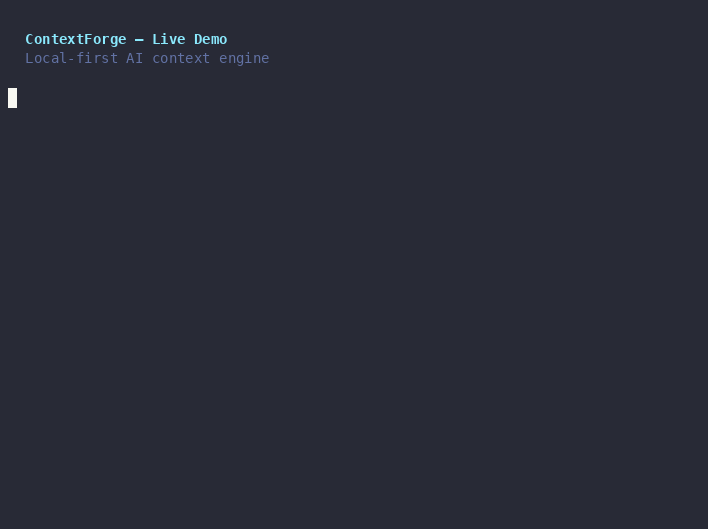

# ContextForge

> Local-first project memory engine for developers and AI agents.

AI assistants forget context between sessions, hallucinate project details, and have no awareness of decisions made weeks ago. ContextForge solves this by maintaining a **local, deterministic, git-tracked memory layer** of your codebase — structured Markdown documents that capture architecture, active context, technical decisions, and open questions.

This memory can be queried directly from the terminal or injected as a precise context window when prompting any LLM — saving 60-80% on token overhead compared to raw codebase dumps.

```bash
contextforge init    → scaffold the memory layer + run initial scan
contextforge scan    → analyse the repo and populate all docs
contextforge update  → re-sync only what changed (SHA-256 diff)
contextforge ask "how is authentication handled?"
```



---

## Why ContextForge

Modern AI assistants have no persistent memory of your project. Every session starts from scratch. ContextForge fixes this by maintaining a **local, deterministic, git-tracked memory** that you control completely:

- **No cloud dependency** — all scanning and document generation runs locally
- **LLM-agnostic** — pluggable providers; works fully offline with `null` provider
- **Incremental** — `update` detects file-level changes via SHA-256 hashes and regenerates only affected documents
- **Human-readable** — every artifact is plain Markdown, editable by hand
- **Token-aware** — `brief` compresses context into a token budget you set, safe to paste into any LLM prompt

---

## Architecture

ContextForge is organised in three layers:

```
┌─────────────────────────────────────────────────┐
│                   CLI layer                      │
│  init · scan · update · decisions · brief · ask  │
└─────────────────────┬───────────────────────────┘
                      │
┌─────────────────────▼───────────────────────────┐
│                  Core layer                      │
│                                                  │
│  ┌──────────┐  ┌──────────┐  ┌───────────────┐  │
│  │ Scanner  │  │ Updater  │  │   Generators  │  │
│  │          │  │          │  │               │  │
│  │IgnoreEng │  │ChangeDet │  │ProjectOverview│  │
│  │FileWalker│  │SelectUpd │  │Architecture   │  │
│  │Summarizer│  └──────────┘  │ActiveContext  │  │
│  │ Parsers  │                │AIBrief        │  │
│  └──────────┘                └───────────────┘  │
│                                                  │
│  ┌──────────────────────────────────────────┐   │
│  │             Query / Retriever            │   │
│  │  TF-IDF-style keyword scoring over .md  │   │
│  └──────────────────────────────────────────┘   │
└─────────────────────┬───────────────────────────┘
                      │
┌─────────────────────▼───────────────────────────┐
│               Providers layer                    │
│         OllamaProvider · DeepSeekProvider        │
│               NullProvider (offline)             │
└─────────────────────────────────────────────────┘
```

### Scanner

| Module | Responsibility |
|---|---|
| `IgnoreEngine` | Layers `.gitignore` + `.contextforgeignore` + hardcoded defaults. Filters binary files and files > 500 KB. |
| `FileWalker` | Recursive directory traversal delegating every path decision to `IgnoreEngine`. |
| `Summarizer` | Reads each file and builds a `ProjectSummary` — imports, exports, classes, functions, TODOs, git metadata. Dispatches structural parsing via `PARSER_REGISTRY`. |
| `parsers/*` | Regex-based structural extraction for 12 languages: TypeScript, JavaScript, Python, Vue, Svelte, PHP, Ruby, Go, Java, Kotlin, C#, Rust. |

### Updater

| Module | Responsibility |
|---|---|
| `ChangeDetector` | Computes SHA-256 hashes for all current files and diffs against `.contextforge/local/meta.json`. |
| `SelectiveUpdate` | Decides which generators need to re-run based on the change diff. |

### Generators

Each generator receives a `ProjectSummary` and produces one Markdown document:

| Generator | Output file |
|---|---|
| `generateProjectOverview` | `project-overview.md` |
| `generateArchitecture` | `architecture.md` |
| `generateActiveContext` | `active-context.md` |
| `generateAIBrief` | `ai-brief.md` |

### Query / Retriever

`retrieveContext` implements keyword-frequency retrieval over all Markdown files in `.contextforge/`. Files are split into sections at `##`/`###` headings; each section is scored by the fraction of query terms matched, and the top-5 chunks are returned and fed to the active LLM provider.

---

## Project Structure

```
contextforge/
├── src/
│   ├── cli/
│   │   ├── index.ts                  # CLI entry point (Commander)
│   │   └── commands/
│   │       ├── init.ts
│   │       ├── scan.ts
│   │       ├── update.ts
│   │       ├── decisions.ts
│   │       ├── brief.ts
│   │       └── ask.ts
│   ├── core/
│   │   ├── scanner/
│   │   │   ├── file-walker.ts
│   │   │   ├── ignore-engine.ts
│   │   │   ├── summarizer.ts
│   │   │   └── parsers/              # 12 language parsers
│   │   ├── updater/
│   │   │   ├── change-detector.ts
│   │   │   └── selective-update.ts
│   │   ├── generators/
│   │   │   ├── project-overview.ts
│   │   │   ├── architecture.ts
│   │   │   ├── active-context.ts
│   │   │   └── ai-brief.ts
│   │   └── query/
│   │       └── retriever.ts
│   └── providers/
│       ├── base.ts                   # LLMProvider interface
│       ├── factory.ts
│       ├── ollama.ts
│       ├── deepseek.ts
│       └── null.ts
├── .contextforge/                    # Memory layer (git-tracked)
│   ├── project-overview.md
│   ├── architecture.md
│   ├── active-context.md
│   ├── coding-rules.md
│   ├── technical-decisions.md
│   ├── open-questions.md
│   ├── ai-brief.md
│   └── local/                        # Machine-local, git-ignored
│       └── meta.json                 # File hashes for incremental updates
└── dist/                             # Compiled output (tsup)
```

---

## Installation & Setup

### Prerequisites

- **Node.js ≥ 20**
- **npm ≥ 10**
- Git (optional, enables branch and commit metadata in generated docs)

### Install from source

```bash
git clone https://github.com/simonecamerano/contextforge.git
cd contextforge
npm install
npm run build
npm link    # makes `contextforge` available globally
```

### Use without installing

```bash
npx contextforge init
```

For scripts and CI, avoid prompts with an explicit provider:

```bash
npx contextforge init --provider null
```

---

## CLI Commands

### `init`

Initializes ContextForge in the current directory. Scaffolds `.contextforge/` with seven starter Markdown files, a `roadmap.md` template, a root `AGENTS.md` bootstrap, detailed agent rules at `.agent/rules/scelta_modello.md`, and immediately runs a full scan.

```bash
contextforge init
```

Non-interactive setup is also supported:

```bash
contextforge init --provider null
contextforge init --provider ollama --model llama3 --ollama-host http://localhost:11434
contextforge init --provider deepseek --model deepseek-chat --deepseek-api-key "$DEEPSEEK_API_KEY"
contextforge init --yes   # defaults to offline mode, skips the enterprise checklist prompt
```

By default `init` asks whether to scaffold an opt-in production-readiness checklist (most projects don't need it). Skip the prompt either way:

```bash
contextforge init --enterprise-checklist   # force-include it, no prompt
contextforge init --yes                    # force-skip it, no prompt
```

Files created:
```
AGENTS.md                         # Root agent bootstrap for compatible coding agents
roadmap.md                        # Phase/task template, tracked automatically in active-context.md
.agent/
└── rules/
    ├── scelta_modello.md         # Detailed model-routing and ContextForge workflow rules
    └── enterprise-checklist.md   # Opt-in production-readiness gate (only with --enterprise-checklist or "y" at the prompt)
.contextforge/
├── project-overview.md       # Project description and tech stack
├── architecture.md           # Module structure and architectural decisions
├── active-context.md         # Current work state, active branch, TODOs, roadmap progress
├── coding-rules.md           # Style guide and coding conventions (manual)
├── technical-decisions.md    # Historical ADR log
├── open-questions.md         # Open bugs and questions (manual)
└── ai-brief.md               # LLM-optimised summary, open roadmap tasks
```

`init` also creates or updates `.gitignore` with a default exclusion set — merged idempotently, so existing custom entries are preserved and nothing gets duplicated on repeated runs:

```
.contextforge/local/
.env
.env.*
node_modules/
__pycache__/
*.pyc
venv/
.venv/
dist/
build/
*.log
.DS_Store
.vscode/
.idea/
```

### `scan`

Full repository scan. Walks every file, builds a `ProjectSummary`, and overwrites the three auto-generated docs. Writes SHA-256 hashes to `meta.json` as baseline for `update`.

```bash
contextforge scan
```

### `update`

Incremental sync. Diffs current file hashes against `meta.json` and regenerates only affected documents. Significantly faster than `scan` on large repositories.

```bash
contextforge update
```

| Change type | Documents regenerated |
|---|---|
| Source file modified/added/removed (`.ts`, `.tsx`, `.js`, `.jsx`, `.py`, `.vue`, `.svelte`, `.php`, `.rb`, `.go`, `.java`, `.kt`, `.cs`, `.rs`) | `architecture.md`, `active-context.md`, `ai-brief.md` |
| Manifest changed (`package.json`, etc.) | `project-overview.md` + above |
| No relevant source/manifest changes | `active-context.md`, `ai-brief.md` |

### `decisions`

Records a new Architecture Decision Record (ADR) in `technical-decisions.md`. Options can be supplied as flags or entered interactively.

```bash
contextforge decisions \
  --title "Use Zod for schema validation" \
  --context "Need runtime validation of external API responses" \
  --decision "Adopt Zod as the single validation library" \
  --alternatives "Joi, Yup, hand-rolled validators" \
  --consequences "Smaller bundle, TypeScript-first inference; adds a runtime dependency"
```

### `brief`

Generates `ai-brief.md` — a token-budget-aware summary of the entire project, safe to paste directly into any LLM prompt.

```bash
contextforge brief                  # default 4000 token budget
contextforge brief --budget 1500    # tight budget
contextforge brief --budget 8000    # generous budget
```

### `ask`

Retrieves relevant sections from `.contextforge/` documents and either prints them (offline) or sends them to an LLM for a synthesised answer.

```bash
# Offline — prints raw retrieved chunks
contextforge ask "where are the parsers defined?"

# With Ollama (local)
contextforge ask "how does the ignore engine work?" --provider ollama

# With DeepSeek (cloud)
contextforge ask "what technical decisions have been made?" --provider deepseek
```

---

## LLM Providers

### Ollama (local)

Runs open-source models entirely on your machine — no API key required.

```bash
curl -fsSL https://ollama.com/install.sh | sh
ollama pull llama3
contextforge ask "explain the scanner" --provider ollama
```

### DeepSeek (cloud)

```bash
export DEEPSEEK_API_KEY=sk-xxxxxxxx
contextforge ask "summarise recent decisions" --provider deepseek
```

### Offline mode

No provider configured — prints retrieved chunks with relevance scores. Useful for inspecting what context would be sent to a model.

---

## Environment Variables

| Variable | Default | Description |
|---|---|---|
| `CONTEXTFORGE_PROVIDER` | `null` | Default LLM provider (`ollama`, `deepseek`, `null`) |
| `OLLAMA_HOST` | `http://localhost:11434` | Ollama server URL |
| `OLLAMA_MODEL` | `llama3` | Default Ollama model |
| `DEEPSEEK_API_KEY` | — | Required for DeepSeek |
| `DEEPSEEK_MODEL` | `deepseek-chat` | Default DeepSeek model |

---

## The `.contextforge/` Directory

| File | Type | Description |
|---|---|---|
| `project-overview.md` | Auto-generated | Project name, stack, dependencies, scripts |
| `architecture.md` | Auto-generated | Module-by-module export/import map |
| `active-context.md` | Auto-generated | Current branch, recent commits, TODOs |
| `coding-rules.md` | Manual | Team style guide and conventions |
| `technical-decisions.md` | Append-only | ADR log managed by `decisions` |
| `open-questions.md` | Manual | Bugs, questions, areas of uncertainty |
| `ai-brief.md` | Auto-generated | Token-budget-aware summary for LLMs |
| `local/meta.json` | Machine-local | File hashes baseline — git-ignored |

Commit everything except `local/`. The auto-generated files keep a browseable history of your project's evolution.

---

## Ignore Rules

Three-layer ignore system:

| Priority | Source | Notes |
|---|---|---|
| 1 (lowest) | Built-in defaults | `node_modules/`, `.git/`, `dist/`, `build/`, `coverage/`, `.contextforge/local/` |
| 2 | `.gitignore` | All rules from the project's existing `.gitignore` |
| 3 (highest) | `.contextforgeignore` | ContextForge-specific exclusions |

Additionally: files > 500 KB and binary files are always excluded.

---

## Agentic Workflow Integration

When you run `contextforge init`, it creates agent-facing files:

- `AGENTS.md` — short root bootstrap for compatible coding agents and IDEs
- `.agent/rules/scelta_modello.md` — detailed model-routing policy and ContextForge workflow rules
- `.agent/rules/enterprise-checklist.md` — opt-in production-readiness gate (only if scaffolded at `init` time)

Recommended startup chain:

```text
AGENTS.md
   ↓
.agent/rules/scelta_modello.md
   ↓
.contextforge/*.md
   ↓
actual source files
```

In an agent-supported IDE (Claude Code, Cursor, Windsurf, Antigravity-style workflows):

1. The agent discovers `AGENTS.md` at the project root
2. `AGENTS.md` points it to `.agent/rules/scelta_modello.md`
3. The rules tell the orchestrator to use `.contextforge/` as a routing map — pass `$(cat .contextforge/ai-brief.md)` as context when delegating to another model's CLI, instead of dumping raw source files into the prompt
4. The orchestrator decomposes the task and assigns each piece to the right model (a role table covers Qwen/Claude/Gemini/Codex/DeepSeek by task type)
5. Implementing models must read the actual source files before changing code
6. Every implementation task ends with real verification: targeted tests, build/typecheck, or smoke test
7. If `.agent/rules/enterprise-checklist.md` exists, it gates any deploy-bound completion: the orchestrator must output a literal per-item verification table (status + evidence) before declaring something production-ready — a verbal "checklist passed" doesn't count

`scelta_modello.md` also enforces a non-negotiable fallback: **if the orchestrator can't or won't follow one of these rules, it must stop and ask for confirmation instead of silently doing the task itself.** This exists because rule files are advisory text, not a technical sandbox — nothing stops an agent from using its own native file-edit tools instead of delegating, especially once a delegated CLI call fails. Surfacing the deviation immediately, rather than letting it cascade, is the actual enforcement mechanism.

ContextForge is a **routing map**, not a source-code replacement. It helps the orchestrator choose what to read next, instead of dumping the whole repository into the prompt.

Result: **60-80% reduction in token overhead** on large codebases.

---

## Roadmap

- [ ] **MCP Server** — expose scan, update, and search as a native MCP server for Claude Desktop, Cursor, Windsurf
- [ ] **Semantic search** — upgrade keyword retriever with local vector embeddings
- [x] **12-language parser coverage** — TypeScript, Python, Vue, Svelte, PHP, Ruby, Go, Java, Kotlin, C#, Rust, manifests
- [x] **Opt-in enterprise readiness checklist** — production-readiness gate scaffolded at `init` time, enforced with a mandatory verification table
- [x] **Stop-and-confirm fallback** — orchestrator must surface (not silently bypass) any rule it can't or won't follow

---

## Running Tests

```bash
npm test           # run all tests once
npx vitest         # watch mode
```

Test coverage includes all parsers, scanner modules, updater, generators, providers, and retriever.

---

## Development

```bash
npm install
npm run build      # compile once
npm run dev        # watch mode (rebuilds on save)
npx eslint .
npx prettier --write .
```

Targets Node.js 20, compiled to ESM via tsup.

---

## Author

**Simone Camerano** — AI workflow engineer and full stack developer.

I build tools that solve real problems in development workflows. ContextForge came from a concrete frustration: every AI-assisted coding session starts from scratch, with no memory of what was decided, why, or where the project stands. This is the infrastructure layer that fixes that.

- 🌐 [simonecamerano.dev](https://simonecamerano.dev)
- 💼 [linkedin.com/in/simone-camerano](https://linkedin.com/in/simone-camerano)
- 🐙 [github.com/simonecamerano](https://github.com/simonecamerano)

---

## License

MIT
